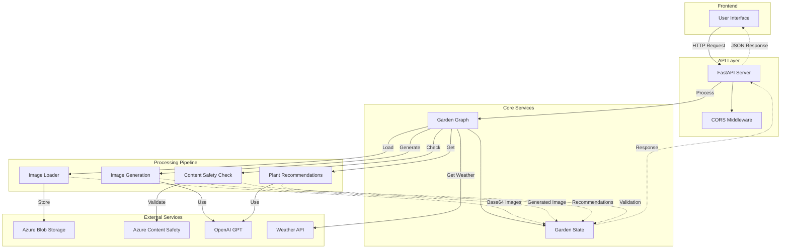

# City Garden

A smart garden design assistant that analyzes garden conditions and provides personalized recommendations.

## Overview

City Garden is an AI-powered application that helps urban gardeners design and optimize their garden spaces. It analyzes various factors such as sun exposure, micro-climate, hardscape elements, and environmental conditions to provide tailored plant recommendations and design suggestions.

## Features

- **Garden Analysis**: Analyzes sun exposure, micro-climate, and existing hardscape elements
- **Environmental Factors**: Retrieves climate data based on location
- **Wind Pattern Analysis**: Analyzes wind patterns and their impact on garden design
- **Style Preferences**: Incorporates user style preferences into recommendations
- **Comprehensive Reports**: Generates detailed garden design reports with plant recommendations
- **Garden Visualization**: Generates visual representations of the recommended garden design
- **Content Safety**: Validates images for appropriate content
- **REST API**: Provides a FastAPI endpoint for garden planning

## Project Structure

```
city-garden/
├── src/
│   ├── main.py                        # Main application entry point
│   ├── api.py                         # FastAPI implementation
│   ├── run_api.py                     # API server runner
│   └── city_garden/
│       ├── __init__.py
│       ├── city_garden_nodes.py       # Graph node implementations
│       ├── garden_state.py            # State management
│       ├── graph_builder.py           # Graph construction
│       ├── llm.py                     # LLM configuration
│       └── services/
│           ├── image_loader.py        # Azure blob storage image loader
│           ├── content_safety.py      # Image/Text safety analysis
│           └── image_generation.py    # Garden visualization service
├── tests/
├── .env                               # Environment variables
├── requirements.txt                   # Project dependencies
└── README.md                          # This file
```

## Architecture



## Installation

1. Clone the repository:
   ```bash
   git clone https://github.com/yourusername/city-garden.git
   cd city-garden
   ```

2. Create a virtual environment:
   ```bash
   python -m venv venv
   source venv/bin/activate  # On Windows: venv\Scripts\activate
   ```

3. Install dependencies:
   ```bash
   pip install -r requirements.txt
   ```

4. Set up environment variables:
   Create a `.env` file in the root directory with the following variables:
   ```
   # Azure Storage credentials
   AZURE_STORAGE_ACCOUNT_NAME=your_account_name
   AZURE_STORAGE_ACCOUNT_KEY=your_account_key

   # Azure Content Safety API credentials
   AZURE_CONTENT_SAFETY_ENDPOINT=your_endpoint
   AZURE_CONTENT_SAFETY_KEY=your_key

   # OpenAI API credentials
   OPENAI_API_KEY=your_key
   ```

## Usage

### Running the API Server

```bash
python src/run_api.py
```

The API will be available at `http://localhost:8000`

### API Endpoints

#### POST /api/garden_plan

Request body:
```json
{
  "image_urls": [
    "https://your-storage-account.blob.core.windows.net/images/example.jpg"
  ],
  "user_preferences": {
    "growType": "edible",
    "subType": "herbs",
    "cycleType": "perennial",
    "winterType": "outdoors"
  },
  "location": {
    "latitude": 52.52,
    "longitude": 13.405,
    "address": "Berlin, Germany"
  }
}
```

Response:
```json
{
  "garden_image_url": "https://your-storage-account.blob.core.windows.net/images/garden_design.png",
  "plant_recommendations": [
    {
      "name": "Plant Name",
      "description": "Plant description",
      "care_tips": "Care instructions"
    }
  ]
}
```


## License

This project is licensed under the MIT License - see the LICENSE file for details.

## Acknowledgments

- Azure Blob Storage for image storage
- Azure Content Safety for image validation
- OpenAI for image generation and plant recommendations
- FastAPI for the API framework
